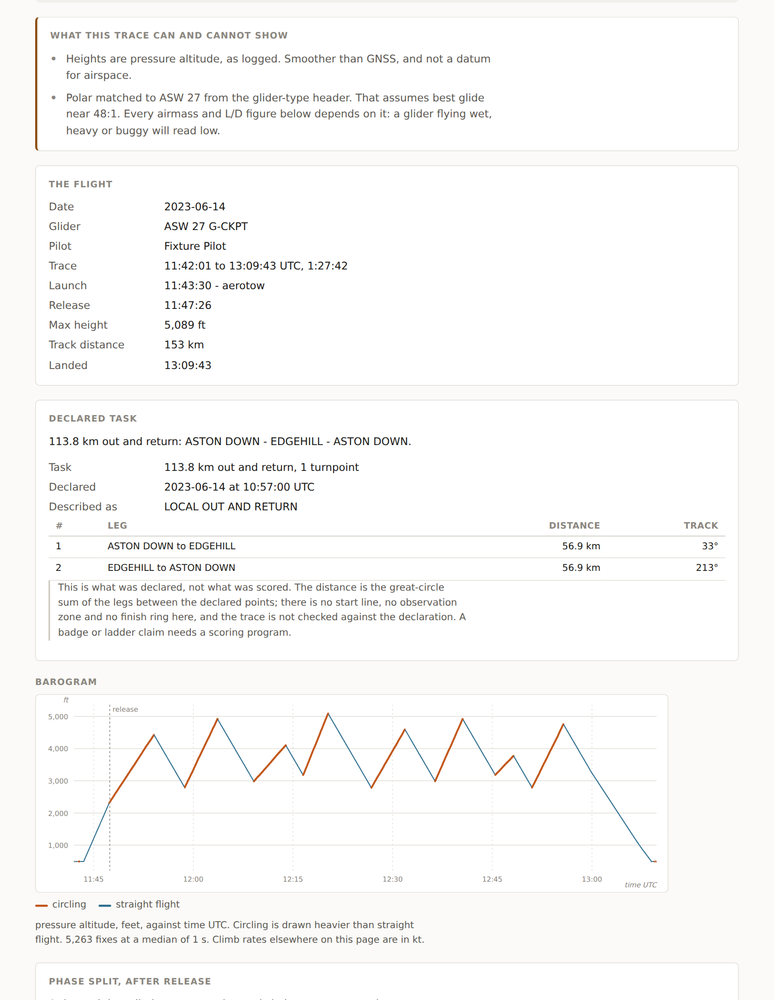

# IGC Analyser

Drop a glider flight log in a browser and get a soaring debrief: the phase
split, the climbs and their circle geometry, the wind, and what the air was
doing on the straight legs.

**[nealedj.github.io/igc-analyser](https://nealedj.github.io/igc-analyser/)**



Everything runs client-side. The file is read with the File API and analysed in
the tab; there is no backend, no upload and no analytics. Once the page has
loaded it works with the network off.

## What it tells you

- **Phase split** — how much of the flight after release was spent circling.
  This decides what kind of debrief the flight deserves: a day spent 15%
  circling is not a thermalling flight, and grading its climbs as though it
  were misses what made it good.
- **Climbs** — average and best sustained rate, circle time, bank, radius and
  wind-corrected airspeed, plus a circle-by-circle breakdown showing whether
  centring improved, decayed or oscillated.
- **Wind** — from the drift of whole circles, with the circle count behind each
  estimate so you can see when it is not evidence.
- **The declared task, and whether it was flown** — what the `C` records say
  the flight was flown against: the shape, the legs with their distances and
  tracks, and the total. The take-off and landing records are labelled and kept
  out of it, because counting them turns a 300 km triangle into a five-leg
  course by way of the launch point. Then the trace against it: where the start
  was crossed, when each turnpoint was rounded, the finish, and the speed —
  "103 km/h round the 300", which is the number a pilot came back for. The
  observation zone is a choice on the page, a 1 km cylinder or the FAI sector,
  because the file does not carry one. It is still not a score, and the page
  says so: no start height or time limits, no airspace, no penalties.
- **Straight legs** — the airmass energy balance: the vertical motion of the
  air the glider flew through, after subtracting polar sink for the speed and
  density it was flown at. The final glide and the landing circuit are one
  unbroken run in the trace and are reported as two, so a twenty-minute glide
  home is not filed as a very long landing. Where the task was finished the cut
  is at the finish rather than at circuit height, which is where the glide was
  aimed.
- **What the trace cannot show** — stated above the figures it affects rather
  than in a footnote. A coarse trace cannot show centring inside a circle, and
  every airmass figure is only as good as the assumed polar.

Three things the file cannot tell you can be set on the page. The **polar**,
when the glider-type header is missing or names the wrong glider. The **release
time**, when the tow ran through lift and the heuristic put it in the wrong
place — everything after release is measured from it. And the **wing loading**,
because the polars are dry at club loading and no IGC file records what the
glider weighed: water or a heavy pilot moves every airmass figure further than
the choice between two plausible polars does.

## Running it locally

```bash
npm install
npm run dev
```

`npm run build` produces a `dist/` of static assets that works from any static
host. Asset paths are relative to Vite's `base`, which comes from `BASE_PATH`,
so the same source deploys to a domain root or a subpath:

```bash
npm run build                        # served at /
BASE_PATH=/igc-analyser/ npm run build   # served at /igc-analyser/
```

There is no map basemap and no runtime network access of any kind. The track is
drawn as vector geometry.

## Using the analysis as a library

`src/core/` is pure: no DOM, no I/O and no third-party dependencies, and it is
the package entry point. `npm run check-core` enforces that.

```ts
import { analyse } from 'igc-analyser';

const { result } = analyse(igcText);
console.log(result.phase.circling_fraction, result.climbs.length);
```

`src/cli.ts` is a thin Node wrapper for the same thing:

```bash
npm run analyse -- flight.igc
```

## Tests

The analysis is a port of a working Python implementation, vendored at
[`reference/igc_analyse.py`](reference/). That script is the specification and
the test oracle — nothing imports it at runtime and none of it is shipped.

```bash
npm test               # unit tests, export format, golden fixtures vs the oracle
npm run verify-fixtures # regenerate from the oracle and diff (needs python3)
npm run check-core     # core stays DOM-free and dependency-free
npm run lint           # oxlint
```

`npm run lint` is [oxlint](https://oxc.rs/docs/guide/usage/linter.html), one
dev dependency and no formatter. The formatting here is consistent and was
maintained by hand, and a formatter would reflow it to no benefit; the linter's
job is to catch defects and to hold the conventions the code already follows.
Rules turned off in [`.oxlintrc.json`](.oxlintrc.json) say why, at the config
rather than line by line at the site.

Where the port differs from the oracle on purpose, the golden tests are handed
the oracle's own inputs — its polar database, its leg segmentation — so the
comparison stays exact rather than writing off a whole field as expected drift.
Which differences those are, and why, is in
[`test/DIVERGENCE.md`](test/DIVERGENCE.md).

Golden fixtures live in `test/golden/`: an IGC file and the oracle's JSON for
it. The port has to match every number to within float drift. Where it diverges
on purpose, it is registered in `test/divergence.ts` and explained in
[`test/DIVERGENCE.md`](test/DIVERGENCE.md) — silent divergence is a defect.

### About the fixtures

They are synthetic, generated by [`test/tools/make-traces.ts`](test/tools/).
This repository is public, and a real trace is somebody's flight: it carries
their name, their registration and where they fly. Synthetic traces also let
the set span the cases that need covering rather than whatever was to hand —
a thermal day, a ridge day, wave, a short circuit, a two-seater, a declared
300 km triangle flown to a long final glide, a coarse ground-station trace with
a dead pressure channel, a logger whose I record lies about its own extensions,
and a flight across midnight.

Drop your own `.igc` files into `test/golden/` and `npm run make-fixtures`
picks them up.

## The export

The **Download flight page bundle** button produces a zip of `flight.json`,
`trace.svg` and `barogram.svg`: everything on the page in a form a flight page
can consume, so publishing a badge flight becomes a repeatable thing rather
than a hand-built one.

It is a **published file format**, specified in
[`docs/export-format.md`](docs/export-format.md), and it is the only interface
between this app and anything that renders a flight page. Changes to it are
breaking and carry a `schemaVersion` bump.

Every number in `flight.json` is SI, whatever units the page is showing. The
SVGs are static, carry no scripts or external references, and take their
colours from CSS custom properties, so a host page themes them by inlining the
markup and setting `--igc-circling` and friends.

The format also carries the caveats as data, not prose: `polar.matched`,
`launch.releaseConfident`, `quality.coarse` and `wind.unreliable` are there so
a consuming page can be as honest as this one is.

## Deployment

Pushes to `main` build and publish to GitHub Pages via
[`.github/workflows/deploy.yml`](.github/workflows/), as a project page at
`https://nealedj.github.io/igc-analyser/`.

One-time setup, in the repository settings: **Pages → Build and deployment →
Source: GitHub Actions**. Nothing else; no DNS, no branch to create.

The workflow passes `enablement: true` to `actions/configure-pages`, so it can
also make that switch itself on a repository where Pages has never been set up.
If the source is left as **Deploy from a branch**, GitHub's own branch builder
publishes the repository root instead — which serves the unbuilt `index.html`,
whose only script tag points at `src/main.ts`. The browser will not execute
TypeScript, so the result is a blank page from a deploy that looked like it
succeeded. The workflow now fails loudly rather than letting that ship.

To move it to a custom domain later, set `BASE_PATH: /` in the workflow, add a
step writing the domain to `dist/CNAME`, and point a DNS `CNAME` record at the
Pages host. No source change is needed either way — that is what the
`BASE_PATH` indirection is for.

## Licence

MIT. See [LICENSE](LICENSE).

The glider polars in [`src/data/polars.json`](src/data/) are indicative values
at typical club loading, not manufacturer-certified figures. Treat any figure
derived from them accordingly — the app says which polar it used and why.

They are generated, not hand-written: `npm run make-polars` derives each
glider's points from published figures, so the fitted curve reproduces the
glider on the label rather than something 15% better, and `npm test` fails on an
entry that has drifted from its own published figures.

Each curve is anchored at two published places, best glide and a point out at
cruise speed, because best glide alone leaves the curvature to an assumption and
the curvature is what high-speed sink is made of. Anchored at one, these curves
read about 13% low above 150 km/h and up to 41% low — on exactly the fast final
glides where the airmass figure gets used. The arithmetic, what a quadratic can
and cannot represent, and why a derived cubic is worse rather than better, are
documented in [`test/tools/make-polars.ts`](test/tools/).
